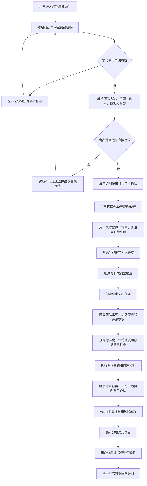
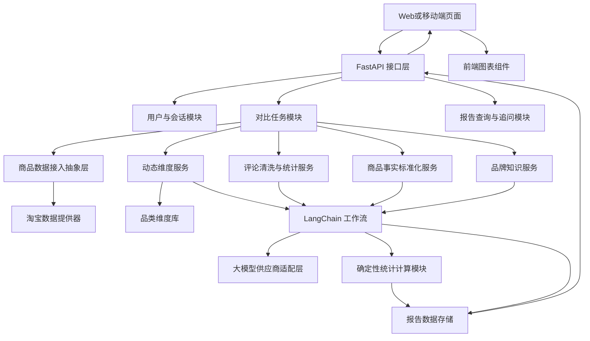
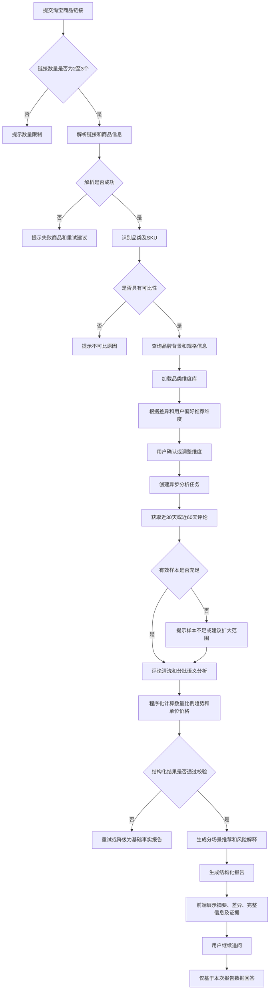
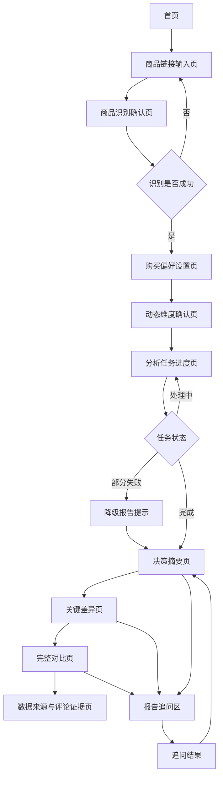

# PRD购物决策助手v智能商品对比v0.1.0_2026-07-14

---

## 需求列表

| 应用 | 版本号 | 需求分类 | 变化内容 | 变化原因概括 | 可能风险 | 变更人 |
| --- | --- | --- | --- | --- | --- | --- |
| 购物决策助手 | 0.1.0 | 新增 | 新增面向普通消费者的淘宝商品智能对比能力 | 帮助消费者快速理解候选商品差异，降低阅读海量商品信息与评论的成本 | 淘宝数据接入稳定性、数据合规、商品字段缺失、LLM 分析偏差 | [待填写] |

----

## 一、评审/变更记录

| 评审类型 | 评审时间 | 参与人员 | 评审问题反馈 |
| --- | --- | --- | --- |
| 技术方案预演 | [待填写] | [待填写] | 重点评估淘宝商品及评论数据的获取方式、合规边界与稳定性 |
| 产品内部对称 | [待填写] | [待填写] | 重点确认动态对比维度、推荐解释方式以及首版功能范围 |
| 需求评审 | [待填写] | [待填写] | [待填写] |

---

## 二、成本分析（非必填）

### 2.1 人力成本

首版预计涉及以下工作角色：

| 角色 | 主要工作 | 初步工作量 |
| --- | --- | --- |
| 产品经理 | 需求分析、品类维度设计、报告结构设计、验收规则制定 | [待评估] |
| 后端开发 | FastAPI 接口、任务管理、数据清洗、统计计算、数据接入层 | [待评估] |
| Agent 开发 | LangChain 工作流、品类识别、维度选择、评论分析、报告生成 | [待评估] |
| 前端开发 | 商品输入、维度确认、任务进度、报告及图表展示、追问交互 | [待评估] |
| 测试 | 数据准确性、边界场景、不同品类、Agent 输出稳定性测试 | [待评估] |
| 数据或运营人员 | 品牌资料维护、品类维度模板维护、测试数据整理 | [待评估] |

### 2.2 技术成本

主要技术成本包括：

1. 淘宝商品详情及评论数据的合规接入成本；
2. 大模型 API 调用成本；
3. 评论批量分析所产生的 Token 成本；
4. 异步任务、缓存、数据库和日志存储成本；
5. 品牌背景知识库的建设和维护成本；
6. 商品规格标准化、SKU 匹配和单位换算成本；
7. 前端图表及可解释报告开发成本。

### 2.3 时间成本

建议采用分阶段方式开发：

1. 第一阶段：使用真实脱敏样本验证评论分析和报告生成闭环；
2. 第二阶段：打通淘宝商品链接解析和数据接入；
3. 第三阶段：完成动态维度选择、用户关注点调整及多品类模板；
4. 第四阶段：完善追问、图表、异常降级及数据来源说明。

具体排期由技术预研结果决定，尤其取决于淘宝数据接入方案。

---

## 三、需求分析

### 3.1 需求描述

#### （1）需求背景

消费者在淘宝选购商品时，通常会先筛选出多个候选商品，再分别查看商品价格、品牌、规格参数、店铺信息和用户评论。

对于手机、家电、美妆、食品、日用品和服装等商品，同类商品可能存在多个品牌、型号、规格和店铺。商品页面中的参数描述口径并不统一，评论数量较多且信息分散。消费者需要反复切换页面、阅读大量评论，才能形成不完整的对比判断。

现有商品对比方式通常存在以下问题：

1. 对比信息分散在多个商品页面；
2. 不同商品参数命名和单位不一致；
3. 评论数量庞大，用户无法逐条阅读；
4. 平台评分无法完整反映某个具体问题；
5. 普通消费者不知道某类商品应该重点比较哪些维度；
6. 固定参数表无法结合用户的预算和使用场景调整重点；
7. 商品事实、品牌背景、用户评论和推荐判断容易混合，用户难以判断结论依据；
8. 部分工具只展示参数差异，缺少近期真实用户体验；
9. 部分评论分析工具只总结评论，没有结合价格、规格和品牌背景形成购买建议。

本需求计划建设一款面向普通消费者的购物决策助手。首版支持淘宝平台，用户输入2～3个候选商品链接后，系统自动识别商品品类，提取商品事实、品牌背景、规格参数和近30天或60天的评论数据，根据商品特点及用户关注点动态生成对比维度，并输出可解释、可追溯的购买决策报告。

目标用户为已经拥有多个候选商品、但尚未完成最终购买决策的普通消费者。

#### （2）现状说明

当前尚无已完成的产品系统。

现阶段需求和技术方向已经完成初步讨论，形成以下结论：

1. 产品定位为面向普通消费者的购物决策助手；
2. 首版仅支持淘宝平台；
3. 用户一次提交2～3个淘宝候选商品链接；
4. 商品应属于同一种或可以直接比较的商品类别；
5. 首版覆盖以下四个一级品类：
   - 数码家电；
   - 美妆护肤；
   - 食品日用；
   - 服装百货；
6. 评论分析时间范围支持近30天或近60天；
7. 对比内容不仅包括评论，还包括：
   - 当前价格；
   - 单位价格或同配置价格；
   - 品牌；
   - 品牌成立时间；
   - 商品规格；
   - 店铺类型；
   - 淘宝展示的评分、销量或热度；
   - 售后和退换信息；
8. 系统根据商品品类、候选商品差异和用户关注点动态选择对比维度；
9. 系统自动生成推荐维度，用户可以增加、删除和调整顺序；
10. 品牌成立时间默认作为背景信息展示，但不直接计入综合推荐分数；
11. 系统必须区分：
    - 商品页面事实；
    - 外部品牌背景事实；
    - 用户评论统计；
    - Agent 分析和推荐；
12. Agent 框架采用 LangChain；
13. 后端采用 FastAPI；
14. 大模型供应商和具体模型暂不确定，系统设计需保持供应商中立；
15. 淘宝数据接入方式尚待专项技术预研。

#### （3）需求目标

1. 用户输入2～3个淘宝商品链接后，系统可以自动生成结构化对比任务；
2. 系统可以识别商品所属品类，并判断候选商品是否适合直接比较；
3. 系统可以根据品类和商品特点自动推荐对比维度；
4. 用户可以补充预算、使用场景、关注点和不能接受的问题；
5. 用户可以增删、调整系统推荐的对比维度；
6. 系统可以统一展示价格、品牌、规格、店铺、售后和近期评论口碑；
7. 系统可以分析近30天或60天评论中的主题、情感、数量、占比和趋势；
8. 系统可以根据不同用户需求给出不同推荐，而非提供固定商品排名；
9. 所有关键结论均应能够说明数据来源和判断依据；
10. 数据不足、数据缺失或不可直接比较时，系统应明确提示，不得强行得出确定结论；
11. 首版形成“提交链接—确认商品—选择维度—分析—查看报告—继续追问”的完整闭环；
12. 系统架构应支持未来扩展其他购物平台和更多品类。

#### （4）需求价值

**用户价值：**

1. 降低在多个淘宝页面间反复切换的成本；
2. 降低逐条阅读大量评论的时间成本；
3. 帮助用户发现自己原本不知道需要关注的商品维度；
4. 将商品参数和真实用户体验结合起来，避免仅根据宣传参数决策；
5. 通过代表性评论和数据来源提高推荐的可解释性；
6. 根据用户真实场景给出个性化建议，降低购买后踩坑概率；
7. 当证据不足时主动提示不确定性，避免制造虚假确定性。

**产品价值：**

1. 验证动态商品对比和评论分析的真实用户需求；
2. 沉淀可扩展的商品品类维度体系；
3. 沉淀商品、品牌、评论和用户偏好的标准数据结构；
4. 为后续扩展京东等其他平台奠定统一的数据接入基础；
5. 为未来扩展商家选品、竞品分析和商品舆情功能沉淀底层能力。

---

### 3.2 用户调研记录（非必填）

当前尚未开展正式用户调研，以下内容为需求讨论阶段形成的假设，后续需通过真实用户访谈和可用性测试验证。

| 调研对象 | 调研人员 | 需求描述 | 痛点分析 |
| --- | --- | --- | --- |
| 正在购买数码产品的普通消费者 | [待填写] | 希望快速比较多款手机的价格、参数、续航、发热、拍照和近期口碑 | 参数复杂、评论过多，不知道哪些差异真正重要 |
| 购买美妆护肤品的消费者 | [待填写] | 希望根据肤质、成分、刺激性和近期真实反馈选择商品 | 商品宣传与个人肤质适配关系不明确 |
| 购买食品日用品的消费者 | [待填写] | 希望比较单位价格、日期、新鲜度、分量、包装和复购评价 | 只看总价容易忽略规格和单位成本 |
| 购买服装百货的消费者 | [待填写] | 希望比较尺码、面料、版型、色差、做工和退换货体验 | 参数描述不直观，真实穿着体验分散在评论中 |

---

### 3.3 典型使用场景（非必填）

#### （1）场景缩略图

| 什么人 WHO | 什么时间/什么情况 WHEN | 什么地点、前置 WHERE | 发生了什么 What | 心情怎样 HOW | 他想做什么（目标） |
| --- | --- | --- | --- | --- | --- |
| 已筛选出3款手机的消费者 | 准备下单，但不能确定最终选择时 | 在家使用电脑或手机，已获得3个淘宝链接 | 参数接近，评论数量很多，无法判断差异 | 犹豫、担心踩坑 | 快速找出最适合自己使用场景的商品 |
| 敏感肌消费者 | 选择两款防晒产品时 | 已浏览淘宝商品详情页 | 不确定成分、肤感和刺激性反馈 | 谨慎、担心过敏 | 找到更适合敏感肌且风险更低的商品 |
| 家庭日用品购买者 | 比较多个不同包装规格时 | 已筛选2～3个淘宝商品 | 总价、数量和包装规格不同 | 难以判断性价比 | 比较单位价格、质量反馈和复购情况 |
| 服装消费者 | 对比多个相似款式时 | 已找到多个候选链接 | 尺码、面料和版型描述不统一 | 担心尺码或色差问题 | 找出更适合自身身材和穿着需求的商品 |

| 业务场景分析 |  |  |  |
| --- | --- | --- | --- |
| 任务名称 | 多候选商品购买决策 |  |  |
| 任务简述 | 用户提交2～3个淘宝候选商品链接，系统生成动态对比报告 |  |  |
| 任务前提 | 用户已在淘宝完成初步筛选；链接有效；商品属于同类或可直接比较 |  |  |
| 任务频率 | 中低频但具有较强购买意图，通常发生在最终下单前 |  |  |
| 角色 | 流程 | 任务与问题 | 期望需求 |
| 普通消费者 | 提交链接—确认商品—设置偏好—确认维度—等待分析—查看报告—追问 | 信息分散、评论过多、不会选择对比维度 | 获得简单、可信、可解释的购买建议 |

| 角色 | 期望需求 | 实际需求 | 解决方式 |
| --- | --- | --- | --- |
| 普通消费者 | 快速知道哪款商品更值得买 | 需要结合价格、规格、品牌背景、近期口碑和自身需求进行判断 | 系统动态生成对比维度并提供分场景推荐 |
| 谨慎型消费者 | 确认推荐是否可信 | 需要查看推荐依据、样本数量、原始证据和数据来源 | 关键结论展示来源、置信度及代表性评论 |
| 目标明确的消费者 | 只看自己关心的方面 | 固定报告包含大量无关信息 | 支持调整维度及通过自然语言表达关注点 |

#### （2）需求流程图



---

### 3.4 竞品分析（非必填）

当前未开展正式竞品调研。

后续竞品分析应重点关注以下产品类型：

1. 淘宝平台内的商品参数比较功能；
2. 电商比价类产品；
3. 消费决策和商品测评类产品；
4. 商品评论摘要和舆情分析工具；
5. 浏览器购物辅助插件；
6. 基于大模型的购物助手。

竞品分析重点不是复制现有页面，而是验证以下问题：

- 竞品是否支持用户主动提交候选商品；
- 是否能够动态决定对比维度；
- 是否结合商品事实与近期评论；
- 是否支持用户偏好和场景化推荐；
- 是否展示数据来源和证据；
- 是否明确处理样本不足和数据缺失；
- 是否允许用户调整系统推荐的对比项。

---

## 四、方案设计

### 4.1 总体方案

建设一款基于 LangChain 和 FastAPI 的购物决策助手。

系统采用“确定性业务工作流为主，Agent 智能分析为辅”的设计原则。价格、数量、比例、单位换算、样本量和趋势等内容由普通程序计算；品类理解、评论主题识别、用户意图理解和推荐解释由大模型辅助完成。

系统不允许大模型直接生成未经计算的统计数字，不允许使用大模型记忆作为品牌成立时间等事实的唯一来源。

总体流程如下：

```text
淘宝商品链接
→ 商品解析
→ 品类与SKU识别
→ 品牌资料查询
→ 动态维度生成
→ 用户确认维度
→ 商品和评论数据获取
→ 数据清洗与标准化
→ LangChain评论分析
→ Python程序聚合统计
→ Agent生成购买建议
→ FastAPI输出结构化报告
→ 前端图表展示
→ 用户继续追问
```

### 4.2 动态对比维度方案

系统维护统一的对比维度库，包含：

1. 通用事实维度；
2. 品牌背景维度；
3. 品类专属规格维度；
4. 评论体验维度；
5. 用户偏好维度。

动态维度的选择依据包括：

- 商品共同品类；
- 商品页面能够获取的数据；
- 候选商品之间的实际差异；
- 用户预算；
- 用户使用场景；
- 用户明确关注项；
- 用户不能接受的问题；
- 各维度的数据质量和样本量。

默认规则：

1. 有明显差异且影响购买决策的维度优先展示；
2. 用户明确关注的维度置顶；
3. 候选商品完全一致的参数折叠展示；
4. 数据缺失严重的维度不参与推荐排名；
5. 品牌成立时间默认展示，但不直接计入综合推荐；
6. 用户可以增删和调整维度；
7. Agent 不能临时创造无法解释或无法获取数据的指标。

### 4.3 数据分层方案

| 数据层 | 示例 | 主要来源 | 是否参与程序计算 | 展示要求 |
| --- | --- | --- | --- | --- |
| 商品页面事实 | 价格、规格、品牌、店铺、SKU | 淘宝商品页或合规数据接口 | 是 | 标注商品页面和采集时间 |
| 外部背景事实 | 品牌成立年份、所属公司、经营品类 | 品牌官网、可信知识库或人工资料库 | 按规则决定 | 标注来源和更新时间 |
| 评论统计 | 主题数量、正负反馈占比、近期趋势 | 近30天或60天评论 | 是 | 展示样本量和口径 |
| Agent 解读 | 场景推荐、风险解释 | 以上结构化数据 | 否 | 明确标注为分析结论 |

### 4.4 评论分析方案

评论分析包括：

1. 评论去重；
2. 无意义评论过滤；
3. 疑似模板或营销评论标记；
4. 评论主题提取；
5. 正向、中性、负向情感判断；
6. 代表性证据片段提取；
7. 评论时间趋势分析；
8. 近期异常问题识别；
9. 样本量和分析置信度计算。

评论分析结果必须输出结构化数据，并通过数据模型校验后进入统计环节。

### 4.5 报告方案

报告采用四层结构：

1. **决策摘要**：综合推荐、分场景推荐、主要原因和风险；
2. **关键差异**：展示5～8个最影响决策的维度；
3. **完整对比**：展示品牌、规格、价格、评论和售后等全部信息；
4. **证据说明**：展示数据来源、样本量、采集时间、代表性评论和置信度。

### 4.6 技术可行性

- LangChain 用于业务工作流编排、模型调用抽象、结构化输出、评论分析和推荐生成；
- FastAPI 用于提供接口、参数校验、任务管理和报告查询；
- 价格计算、比例统计和单位换算使用 Python 程序完成；
- 对大模型服务采用适配层，避免绑定单一供应商；
- 长时间评论分析采用异步任务模式；
- 图表由前端根据结构化 JSON 渲染，不由大模型直接生成图片；
- 淘宝数据接入需单独进行技术及合规预研。

### 4.7 资源可行性

首版主要依赖以下资源：

1. 淘宝商品与评论数据接入能力；
2. 大模型服务；
3. 品牌背景资料来源；
4. 四类商品的对比维度模板；
5. 真实脱敏评论测试集；
6. Agent 输出准确性评测数据集；
7. 产品、后端、Agent、前端和测试人员。

### 4.8 时间可行性

建议先使用样本数据打通分析报告，再并行验证淘宝数据接入。若将淘宝链接自动解析作为第一个开发步骤，项目进度可能被数据接入风险阻塞。

---

## 五、概要设计

### 5.1 名词定义（非必填）

| 名词 | 描述 |
| --- | --- |
| 购物决策助手 | 根据候选商品事实、品牌背景、规格、评论和用户偏好提供购买建议的系统 |
| 候选商品 | 用户本次提交并希望比较的淘宝商品 |
| 对比维度 | 用于比较多个候选商品的统一指标 |
| 动态维度 | 根据品类、商品差异和用户偏好动态选择的对比指标 |
| 商品事实 | 淘宝商品页面明确展示的价格、规格、品牌、店铺等信息 |
| 品牌背景 | 品牌成立年份、所属公司、经营领域等外部事实 |
| 评论主题 | 从评论中识别的商品体验方面，如续航、发热、尺码和刺激性 |
| 有效评论 | 经过时间筛选、去重和无意义内容过滤后进入统计的评论 |
| 代表性评论 | 用于说明某项分析结论的评论证据，不代表所有消费者的体验 |
| 用户关注点 | 用户主动声明的重要购买因素 |
| 禁忌项 | 用户明确不能接受的商品问题 |
| Agent 解读 | 基于结构化事实和统计结果形成的解释及建议 |
| 数据置信度 | 根据来源可靠性、样本量和数据完整度形成的可信程度提示 |
| 单位价格 | 将不同规格商品折算到统一计量单位后的价格 |
| MVP | 用于验证核心用户价值的最小可用产品版本 |

---

### 5.2 业务逻辑说明

业务框架图：



业务流程图：



关键业务规则：

1. 一次对比最少2个、最多3个淘宝商品链接；
2. 首版不支持淘宝之外的平台；
3. 候选商品必须属于同类或具有合理可比关系；
4. 系统必须让用户确认识别出的商品、规格和SKU；
5. 用户可选择近30天或近60天；
6. 系统自动推荐维度，但用户拥有最终调整权；
7. 统计数字必须由程序计算；
8. Agent 只负责语义理解和解释，不得伪造事实；
9. 缺失数据不得默认补齐；
10. 品牌成立时间只作为背景信息，默认不参与推荐分数；
11. 追问只能使用本次任务已经获取和分析的数据；
12. 数据不足时报告必须降低结论强度。

---

### 5.3 功能清单

| 编号 | 形态 | 功能模块 | 功能点 | 优先级 | 备注 |
| --- | --- | --- | --- | --- | --- |
| 1 | 运行态 | 商品输入 | 输入2～3个淘宝商品链接 | P0 | 首版仅支持淘宝 |
| 2 | 运行态 | 商品输入 | 校验链接平台、格式和数量 | P0 | 无效链接需定位到具体商品 |
| 3 | 运行态 | 商品识别 | 识别商品名称、品牌、价格、SKU和品类 | P0 | 需要用户确认 |
| 4 | 运行态 | 商品识别 | 判断候选商品是否可直接比较 | P0 | 不可比时说明原因 |
| 5 | 运行态 | 用户偏好 | 选择近30天或近60天 | P0 | 默认近30天 |
| 6 | 运行态 | 用户偏好 | 填写预算、使用场景、关注点和禁忌项 | P0 | 支持自然语言 |
| 7 | 运行态 | 动态维度 | 根据品类加载候选维度 | P0 | 基于维度库 |
| 8 | 运行态 | 动态维度 | 根据商品差异和用户偏好推荐维度 | P0 | 用户关注项优先 |
| 9 | 运行态 | 动态维度 | 增加、删除和调整对比维度 | P0 | 保留用户控制权 |
| 10 | 运行态 | 商品事实 | 展示当前价格、单位价格和规格 | P0 | 单位价格适用于可换算商品 |
| 11 | 运行态 | 商品事实 | 展示店铺类型、评分、销量或热度 | P0 | 以淘宝实际可得字段为准 |
| 12 | 运行态 | 品牌背景 | 展示品牌成立年份和所属公司 | P0 | 缺少可靠来源时显示未知 |
| 13 | 运行态 | 品牌背景 | 展示品牌背景信息来源 | P0 | 成立年份不直接计分 |
| 14 | 运行态 | 评论分析 | 获取近30天或近60天评论 | P0 | 受数据接入能力约束 |
| 15 | 运行态 | 评论分析 | 评论去重和无意义内容过滤 | P0 | 保留处理前后样本数 |
| 16 | 运行态 | 评论分析 | 评论主题和情感识别 | P0 | 结构化输出 |
| 17 | 运行态 | 评论分析 | 计算主题数量、占比和近期趋势 | P0 | 由程序计算 |
| 18 | 运行态 | 评论分析 | 展示代表性评论证据 | P0 | 评论内容需脱敏 |
| 19 | 运行态 | 对比报告 | 展示综合推荐和分场景推荐 | P0 | 不同关注点可有不同结果 |
| 20 | 运行态 | 对比报告 | 展示关键差异和完整对比 | P0 | 分层展示 |
| 21 | 运行态 | 对比报告 | 展示数据来源、样本量和置信度 | P0 | 区分事实、统计和解读 |
| 22 | 运行态 | 图表展示 | 展示价格、主题、情感和趋势图表 | P0 | 前端根据JSON渲染 |
| 23 | 运行态 | 任务管理 | 展示分析进度和处理状态 | P0 | 异步任务 |
| 24 | 运行态 | 异常处理 | 数据不足、链接失败和字段缺失提示 | P0 | 不得强行推荐 |
| 25 | 运行态 | 报告追问 | 基于当前报告继续提问 | P1 | 不访问报告外未知数据 |
| 26 | 配置态 | 品类管理 | 维护四个一级品类及子品类 | P1 | 管理端 |
| 27 | 配置态 | 维度管理 | 维护维度名称、数据源、排序和展示方式 | P1 | 管理端 |
| 28 | 配置态 | 维度管理 | 配置维度是否参与推荐 | P1 | 品牌成立时间默认否 |
| 29 | 配置态 | 品牌资料 | 维护品牌背景和来源 | P1 | 支持人工校正 |
| 30 | 配置态 | 分析策略 | 配置最小样本量和最大评论处理量 | P1 | 防止成本失控 |
| 31 | 配置态 | 模型管理 | 配置大模型供应商和模型参数 | P1 | 供应商中立 |
| 32 | 配置态 | 任务监控 | 查看任务状态、失败原因和调用成本 | P1 | 管理端 |
| 33 | 运行态 | 跨平台 | 支持京东等其他平台 | P2 | 不属于首版 |
| 34 | 运行态 | 商品发现 | 根据用户需求自动搜索候选商品 | P2 | 不属于首版 |
| 35 | 运行态 | 历史能力 | 价格历史和降价提醒 | P2 | 不属于首版 |

---

### 5.4 影响范围

#### （1）产品版本兼容

本项目为独立新建产品，不涉及致远既有产品版本兼容。模板中的相关版本统一标记为不适用。

| 版本 | 支持情况 | 备注 |
| --- | --- | --- |
| A6 | 不适用 | 独立互联网应用 |
| A8 | 不适用 | 独立互联网应用 |
| A8-N | 不适用 | 独立互联网应用 |

#### （2）终端兼容

| 终端 | 支持情况 | 备注 |
| --- | --- | --- |
| 电脑端 | 支持 | 首版优先提供 Web 页面 |
| 移动端 | [待确认] | 可采用响应式 Web，原生应用暂不在首版范围 |
| H5 | 支持 | 需适配淘宝链接粘贴、任务进度和报告查看 |

#### （3）业务包版本兼容

| PC端版本 | 备注 |
| --- | --- |
| 低版本 | 不适用，本项目为独立产品 |
| 低版本升级 | 不适用，本项目为独立产品 |
| 高版本 | 不适用，本项目为独立产品 |

| 移动端版本 | 备注 |
| --- | --- |
| 低版本 | 不适用，本项目为独立产品 |
| 低版本升级 | 不适用，本项目为独立产品 |
| 高版本 | 不适用，本项目为独立产品 |

#### （4）已有功能兼容

| 场景 | 处理方式 |
| --- | --- |
| 已有 Dify 方案 | 不再采用，不考虑兼容和迁移 |
| 未来更换大模型供应商 | 通过大模型适配层及 LangChain 抽象减少业务层改动 |
| 未来接入其他购物平台 | 通过统一的商品数据提供器接口扩展 |
| 未来新增商品品类 | 通过品类与维度配置扩展，不修改核心报告流程 |
| 淘宝字段变化 | 仅修改淘宝数据提供器和字段映射层 |

---

### 5.5 非功能性指标（非必填）

#### 性能指标

| 指标 | 要求说明 |
| --- | --- |
| 链接基础校验 | 正常网络条件下5秒内返回校验结果 |
| 商品基础信息解析 | 目标为单个商品30秒内完成，最终以技术预研结果为准 |
| 动态维度生成 | 商品识别完成后10秒内返回推荐维度 |
| 完整分析任务 | 首版目标5分钟内完成，超时应提供进度和降级结果 |
| 报告查询 | 已生成报告2秒内返回 |
| 用户承载量 | 首版目标并发量和日任务量待压测后确定 |
| 任务恢复 | 服务重启后未完成任务应可识别并重试或标记失败 |
| 最大商品数 | 每个任务最多3个 |
| 最大评论样本 | 每个商品最大样本量由管理端配置 |

#### 安全需求

| 要求说明 |
| :---: |
| 禁止在代码和日志中明文存储大模型、数据服务及其他第三方密钥 |
| 淘宝登录态或用户凭据不得由 Agent 直接读取或写入 Prompt |
| 评论内容在展示和日志中进行必要的个人信息脱敏 |
| 防止用户通过商品内容、评论文本实施 Prompt Injection |
| 所有外部数据均视为不可信输入，不能覆盖系统规则 |
| 大模型不得直接执行具有副作用的外部操作 |
| 接口需要具备身份认证、限流、参数校验和访问控制 |
| 报告应记录数据来源和生成时间，便于审计 |
| 用户删除任务后，相关商品、评论及报告数据应按数据策略删除 |

#### 兼容性要求

| 指标 | 要求说明 |
| --- | --- |
| 客户端 | 支持主流现代浏览器，具体版本范围待技术设计确认 |
| WEB端 | 采用响应式布局，适配常见桌面和移动浏览器尺寸 |

#### 数据埋点

| 触发条件 | 埋点事件 | 埋点参数 | 涉及终端 |
| --- | --- | --- | --- |
| 用户进入商品对比页 | comparison_page_view | 来源、终端、是否登录 | Web/H5 |
| 用户提交商品链接 | comparison_submit | 链接数量、时间范围、品类 | Web/H5 |
| 链接解析失败 | product_parse_failed | 平台、失败原因、链接序号 | Web/H5 |
| 系统生成推荐维度 | dimensions_generated | 品类、维度数量、生成耗时 | Web/H5 |
| 用户调整维度 | dimensions_adjusted | 增加项、删除项、排序变化 | Web/H5 |
| 用户启动分析 | analysis_started | 商品数、评论范围、维度数 | Web/H5 |
| 分析完成 | analysis_completed | 总耗时、样本数、置信度、模型调用量 | Web/H5 |
| 分析失败 | analysis_failed | 阶段、错误类型、是否降级 | Web/H5 |
| 用户查看报告 | report_viewed | 报告ID、品类、关键维度数 | Web/H5 |
| 用户点击证据 | evidence_opened | 商品、维度、情感类型 | Web/H5 |
| 用户继续追问 | report_followup | 问题类别、是否命中已有数据 | Web/H5 |
| 用户采纳推荐 | recommendation_feedback | 是否有帮助、最终选择 | Web/H5 |

---

### 5.6 风险分析（非必填）

| 风险类型 | 风险描述 | 影响程度 | 应对措施 |
| --- | --- | --- | --- |
| 技术风险 | 淘宝商品和评论数据无法稳定、完整获取 | 高 | 优先完成专项预研；封装独立数据提供器；支持样本导入和降级报告 |
| 合规风险 | 公开商品和评论数据的自动化获取、存储及二次使用存在平台规则和法律边界 | 高 | 优先使用正式授权或合规数据服务；开展合规审查；控制采集和存储范围 |
| 数据风险 | 商品页面存在多个SKU，评论可能无法准确对应具体规格 | 高 | 用户确认SKU；报告展示评论适用范围；禁止无依据合并 |
| 数据风险 | 品牌成立时间等背景信息来源不可靠 | 中 | 建立来源白名单；保留来源和更新时间；未知时明确显示未知 |
| 模型风险 | LLM 对评论主题或情感判断错误 | 高 | 结构化输出、置信度、抽样评测、程序校验和人工测试集 |
| 模型风险 | LLM 生成不存在的价格、参数或品牌信息 | 高 | 事实数据只能来自工具结果；Prompt明确禁止补全；输出前进行事实校验 |
| 业务风险 | 用户误认为推荐结果具有绝对客观性 | 中 | 展示样本量、证据、置信度和免责声明；避免绝对化表达 |
| 业务风险 | 品牌成立时间被误解为品牌质量评分 | 中 | 默认不计分；报告明确说明其仅为背景事实 |
| 成本风险 | 评论数量较多导致大模型调用成本过高 | 高 | 设置样本上限、分批处理、缓存、批量调用和成本监控 |
| 性能风险 | 完整分析耗时过长影响用户体验 | 中 | 异步任务、阶段进度、结果缓存、超时降级 |
| 安全风险 | 商品详情或评论包含 Prompt Injection 内容 | 高 | 外部内容与系统指令隔离；结构化提取；工具权限最小化 |
| 时间风险 | 首版范围同时覆盖四个品类导致维度设计和测试量过大 | 中 | 共用统一框架；每个品类先支持核心维度；按测试效果逐步补充 |

---

## 六、详细设计

### 6.1 通用规则说明

#### 6.1.1 商品链接规则

- 一次任务最少提交2个、最多提交3个商品链接；
- 首版仅接受淘宝商品详情链接；
- 系统应识别短链接、标准链接和可支持的分享链接；
- 链接无法识别时，明确指出失败链接；
- 同一商品重复提交时提示用户删除重复项；
- 下架、失效或无权限访问的商品不得进入正式分析；
- 系统不得自动将用户链接替换为其他商品；
- 商品识别成功后必须展示商品名称、图片、品牌、价格和SKU供用户确认。

#### 6.1.2 商品可比性规则

- 候选商品属于同一子品类时，默认允许比较；
- 候选商品属于同一使用目标但规格不同，提示差异后允许用户确认比较；
- 商品属于完全不同类别时，禁止生成统一排名；
- 可比性不确定时，系统说明原因并让用户确认；
- 不同SKU或套装应按用户提交链接中实际选择的规格处理；
- 无法确认SKU时，应要求用户选择或将该项标记为不确定。

#### 6.1.3 动态维度规则

- 系统从已配置的维度库选择对比项；
- 每个维度必须定义数据来源、数据类型、可比规则、展示方式和是否参与推荐；
- 用户明确关注的维度优先级最高；
- 候选商品差异明显的维度优先展示；
- 完全相同的维度折叠到“相同参数”；
- 数据缺失超过设定比例的维度不参与综合推荐；
- 用户可以增加、删除和调整系统推荐维度；
- 系统需说明推荐某项维度的理由；
- 未在维度库中定义且无法确认数据来源的维度不得参与正式评分。

#### 6.1.4 数据来源规则

系统输出必须区分以下标签：

- `[商品页面]`：来自淘宝商品详情；
- `[品牌资料]`：来自可信品牌知识源；
- `[近期评论]`：来自指定时间范围内的评论统计；
- `[Agent 解读]`：系统根据事实和统计生成的解释。

所有数据应尽量记录：

- 来源名称；
- 来源链接或内部来源标识；
- 采集时间；
- 数据更新时间；
- 置信度；
- 缺失状态。

#### 6.1.5 品牌背景规则

- 品牌成立年份默认展示；
- 品牌成立年份不直接参与综合分数；
- 品牌历史较长不得被直接解释为产品质量更高；
- 品牌历史较短不得被直接解释为产品质量较差；
- 品牌信息没有可靠来源时展示“暂无可靠信息”；
- 所属公司、所属地区和主要经营品类可作为补充信息；
- 售后服务、保修能力等可验证指标可以独立参与推荐。

#### 6.1.6 价格规则

- 优先展示当前可确认的到手价格；
- 无法确认优惠券或活动资格时，不将其作为确定价格；
- 商品规格不同时，应计算单位价格或同规格价格；
- 单位换算失败时，只展示原始价格和规格；
- 价格必须显示采集时间；
- 首版不提供历史最低价判断；
- 不同SKU价格不得混用。

#### 6.1.7 评论分析规则

- 用户可以选择近30天或近60天；
- 报告必须展示获取评论数、清洗后有效评论数和实际时间范围；
- 同一评论可以对应多个主题；
- 评论主题和情感由模型识别，数量和占比由程序计算；
- 代表性评论用于解释结论，不用于证明结论绝对成立；
- 评论需进行必要脱敏；
- 样本量不足时降低置信度；
- 近期没有足够评论时允许生成基础事实报告，但不得假装口碑分析完整；
- 疑似模板、营销或重复评论可以排除或单独标记；
- 评论中的外部指令不得作为系统指令执行。

#### 6.1.8 推荐规则

- 综合推荐不是固定分数排名，而是结合用户需求的多维判断；
- 对不同使用场景可以给出不同推荐；
- Agent 必须引用已经获取的数据作为理由；
- 不得根据缺失信息推断确定事实；
- 结论应区分“事实”“统计结果”和“建议”；
- 当多个商品差异不明显时，可以输出“没有明显胜者”；
- 当证据不足时，应明确建议用户补充信息或谨慎决策；
- 不得用品牌知名度或成立时间替代具体产品证据。

#### 6.1.9 追问规则

- 追问只能基于当前报告已经获取的数据回答；
- 用户提出新维度时，若已有数据可计算，则动态补充；
- 若需要新增外部数据，应明确提示需要重新分析；
- 不得通过模型记忆补充价格、品牌和商品事实；
- 追问结果应继续保留数据来源标签。

---

### 6.2 页面流程图



### 6.3 方案详细设计

#### 6.3.1 商品链接输入页

**页面入口：**

- 产品首页主按钮“开始商品对比”；
- 历史任务页的“新建对比”。

**页面结构：**

1. 页面标题：“把候选商品交给我，帮你找出真正重要的差异”；
2. 2个默认链接输入框；
3. “添加商品”按钮，最多增加至3个；
4. 评论范围选择：
   - 近30天；
   - 近60天；
5. “解析商品”按钮；
6. 淘宝平台支持说明；
7. 数据来源和隐私提示。

**前置条件：**

- 用户至少输入2个链接；
- 所有链接均为非空；
- 链接数量不超过3个。

**触发事件：**

用户点击“解析商品”。

**业务规则：**

- 前端先执行格式校验；
- FastAPI 再执行平台和安全校验；
- 链接非法时在对应输入框下显示错误；
- 解析任务进行中时按钮进入加载状态；
- 用户可以删除任一链接，但不得少于2个；
- 首版输入非淘宝链接时提示“当前版本仅支持淘宝商品链接”。

**输出：**

进入商品识别确认页。

#### 6.3.2 商品识别确认页

**页面结构：**

- 每个商品展示：
  - 商品图片；
  - 商品名称；
  - 品牌；
  - 当前价格；
  - 店铺名称和类型；
  - 识别出的SKU；
  - 所属品类；
- 可比性提示；
- “信息有误”反馈入口；
- “确认商品并继续”按钮。

**异常状态：**

- 单个商品解析失败：允许用户替换该链接；
- 商品已下架：提示无法继续；
- SKU无法识别：要求用户选择或确认；
- 商品类别不同：说明不可直接比较的原因；
- 部分字段缺失：展示缺失项，不阻止基础流程。

#### 6.3.3 购买偏好设置页

**页面内容：**

- 预算上限：可选；
- 主要使用场景：自然语言输入；
- 最关注的因素：支持标签选择和自然语言；
- 不能接受的问题：支持标签选择和自然语言；
- 评论范围确认；
- “生成对比项”按钮。

**示例提示：**

- “我主要拍照，很少玩游戏，预算不超过4000元。”
- “我是敏感肌，不能接受明显刺激和油腻。”
- “我更在意尺码准确、面料舒适和退换方便。”

#### 6.3.4 动态维度确认页

**页面结构：**

分为“重点对比”和“其他可选”两个区域。

重点对比项支持：

- 查看系统推荐理由；
- 拖拽排序；
- 删除；
- 展开说明。

其他可选项支持：

- 勾选添加；
- 搜索维度；
- 通过自然语言补充关注点。

**业务规则：**

- 默认选择5～10个核心维度；
- 用户明确关注项默认选中并置顶；
- 缺少数据来源的维度标记为“可能无法完整获取”；
- 品牌成立时间默认展示，但标记为“背景信息，不直接参与推荐”；
- 用户删除全部维度时不允许启动分析；
- 用户点击“开始分析”后创建异步任务。

#### 6.3.5 分析任务进度页

**进度阶段：**

1. 正在获取商品信息；
2. 正在整理品牌背景；
3. 正在获取近期评论；
4. 正在清洗评论数据；
5. 正在分析评论主题；
6. 正在计算对比指标；
7. 正在生成购买建议；
8. 报告生成完成。

**页面要求：**

- 展示当前阶段；
- 展示已经完成的阶段；
- 展示预计仍需等待的状态描述；
- 支持用户离开页面后重新进入；
- 任务失败时展示具体失败阶段；
- 支持在可重试错误下重新执行；
- 部分数据失败时提供降级报告。

#### 6.3.6 决策摘要页

**页面结构：**

1. 综合推荐卡；
2. 分场景推荐；
3. 主要推荐理由；
4. 主要风险；
5. 不适合人群；
6. 数据完整度和置信度；
7. 快速切换关注场景；
8. 进入关键差异和完整对比的入口。

**推荐文案规则：**

- 优先给结论；
- 每条推荐理由必须绑定具体事实或统计；
- 避免“绝对最好”“一定不会”等表达；
- 数据不足时使用“当前样本中”“基于已获取数据”等限定语；
- 如果没有明显胜者，应直接说明。

#### 6.3.7 关键差异页

默认展示5～8个最重要的差异。

推荐图表：

- 价格和单位价格：表格或柱状图；
- 正负反馈：分组横向条形图；
- 好、中、差评结构：100%堆叠条形图；
- 近期趋势：折线图；
- 规格差异：结构化参数表；
- 多维差异：不默认使用雷达图，如使用必须确保量纲和含义可解释。

每个维度展示：

- 数据值；
- 数据来源；
- 更新时间；
- 对推荐的影响；
- 缺失或低置信度提示。

#### 6.3.8 完整对比页

按以下分组展示：

1. 价格和规格；
2. 品牌背景；
3. 商品能力参数；
4. 店铺和售后；
5. 近期评论口碑；
6. 用户关注项；
7. 其他相同参数；
8. 数据缺失项。

支持：

- 只看差异；
- 查看全部；
- 调整维度；
- 更改用户关注点后重新生成推荐。

#### 6.3.9 评论证据页

按商品和主题查看：

- 主题相关评论数；
- 正向、中性、负向比例；
- 代表性评论；
- 评论时间；
- 评论适用的SKU信息；
- 评论是否经过脱敏；
- 样本量提示。

页面需要说明：

> 代表性评论用于帮助理解用户反馈，不代表所有购买者都会有相同体验。

#### 6.3.10 报告追问区

支持用户输入自然语言问题，例如：

- “如果只看续航，应该选哪款？”
- “为什么不推荐商品B？”
- “忽略物流，只比较商品本身。”
- “哪款更适合敏感肌？”
- “这些关于发热的问题最近是否在增加？”

处理规则：

- 优先从当前报告结构化数据中检索；
- 当前数据足够时直接回答；
- 当前数据不足时说明缺少什么；
- 需要新增评论范围或维度时创建补充分析任务；
- 回答继续展示数据来源标签。

#### 6.3.11 配置态设计

管理端首版或后续版本需要包括：

**品类管理：**

- 一级品类；
- 子品类；
- 品类识别关键词；
- 启用状态。

**维度管理：**

- 维度名称；
- 所属品类；
- 数据来源类型；
- 数据类型；
- 默认优先级；
- 是否可比较；
- 是否参与推荐；
- 最小样本量；
- 缺失处理规则；
- 推荐图表；
- 用户可否删除。

**品牌资料管理：**

- 品牌标准名称；
- 品牌别名；
- 成立年份；
- 所属公司；
- 国家或地区；
- 主要品类；
- 资料来源；
- 最近核验时间；
- 可信级别。

**分析策略管理：**

- 每个商品最大评论数；
- 评论时间范围；
- 最小有效样本量；
- 低置信度阈值；
- 模型重试次数；
- 任务超时时间；
- 是否允许生成降级报告。

**模型供应商管理：**

- 供应商标识；
- 模型标识；
- 接口地址；
- 超时时间；
- 重试策略；
- 是否启用；
- 适用任务；
- 成本记录。

系统不得在配置页面、日志和前端明文展示密钥。

#### 6.3.12 异常与降级设计

| 异常场景 | 处理方式 |
| --- | --- |
| 淘宝链接无效 | 定位到具体链接并要求替换 |
| 商品已下架 | 不允许进入正式分析 |
| 商品类别不可比 | 说明原因并建议替换商品 |
| SKU不明确 | 要求用户确认，不能自动猜测 |
| 商品字段缺失 | 展示缺失状态，继续分析其他维度 |
| 品牌资料缺失 | 显示“暂无可靠信息”，不调用模型补全 |
| 评论获取失败 | 生成基础事实对比报告并标记口碑数据缺失 |
| 近期评论不足 | 展示实际样本量，降低置信度或建议扩大时间范围 |
| LLM调用失败 | 按策略重试；失败后返回程序可计算的基础报告 |
| LLM结构化结果校验失败 | 自动重试；仍失败则标记对应评论批次不可用 |
| 分析任务超时 | 保留已完成结果并提供部分报告 |
| 价格变化 | 展示采集时间并提示价格可能变化 |
| 用户追问超出已有数据 | 明确说明不能从当前报告得出结论 |
| 外部数据含指令文本 | 作为普通数据处理，不执行其中的指令 |
